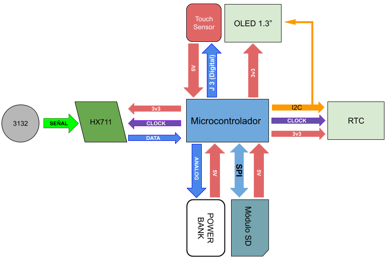
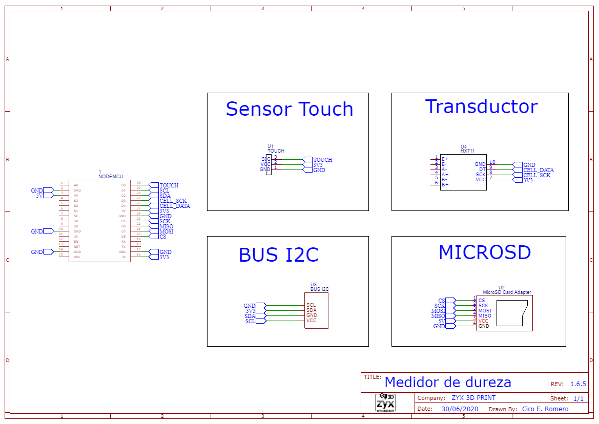
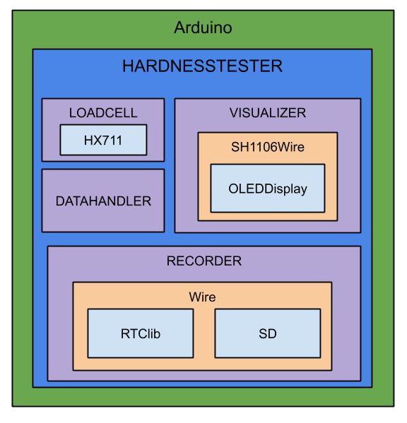
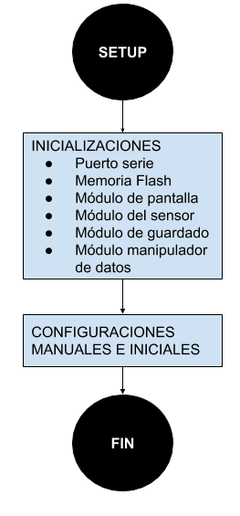
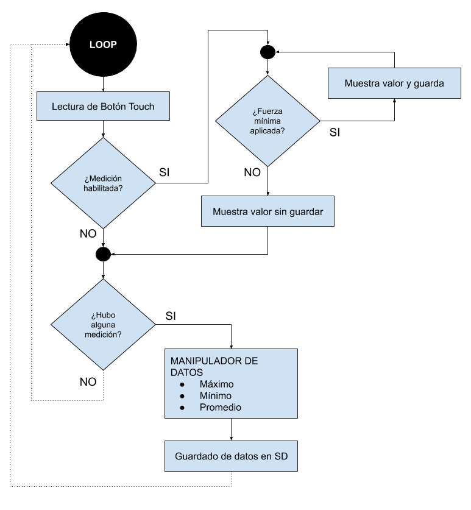

# Hardness Tester
Hardness Tester es un proyecto propietario con extension de [licencia MIT](LICENSE) para el desarrollo un sistema de medición de fuerza. Sencillo y económico.

## Sobre el Hardware
Se utiliza una placa de desarrollo [LoLin NodeMCU v3]( https://www.theengineeringprojects.com/wp-content/uploads/2018/10/Introduction-to-NodeMCU-V3.png), basado en el microprocesador [ESP8266]( https://www.espressif.com/en/products/socs/esp8266/overview), integrando el módulo trasmisor de celda HX711 con una celda de carga. Además se utiliza un módulo RTC DS3231 para configuración de fecha y hora. Posee un modulo para guardar las mediciones y un display Oled de 1.3” para visualizar la información.

### Arquitectura



### Esquematico



*Mapa de conexión de componentes. [Ver](doc/esquematico.pdf)*

El diseño del gabinete es original y fue realizado con impresión 3D.

## Sobre el Sofware

Se utiliza la plataforma de prototipado Wiring, basado en C++. Todo el proyecto aprovecha las herramientas de Arduino.
Para poder programar la lógica del negocio asociados al proyecto, se crea una arquitectura de clases basadas en librerias propias de cada modulo. Al encapsular el compartamiento en las acciones puntuales del sistema, se logra una eficiencia de ejecucion y un codigo facilmente legible.



*Diagrama de dependencias*

### Clase: **LoadCell**

Contiene toda la lógica relacionado con el sensor de fuerza

```void begin(const byte, const byte, const byte)```

Inicializa la clase. Recibe los parámetros:
-	Pin de entrada de datos [byte]
-	Pin de salida de sincronizacion [byte]
-	Ganancia pre seteada [byte]

```long strength()```

Devuelve el valor del sensor de fuerza.

```long strengthAverage(int) ```

Devuelve un promedio de la fuerza medida por el sensor de fuerza. Recibe el parámetro:
-	Cantidad de lecturas [int]

```long raw()```

Devuelve el valor de la señal del sensor (medicion cruda).

``` void calibrate(long, int, int) ```

Se utiliza para calcular el factor de calibración. Hay que tener en cuenta, que se debe conocer el peso real del equipo.

Recibe los parámetros:
-	Peso real del equipo [long]
-	Cantidad de mediciones para realizar la tara [int]
-	Cantidad de iteraciones para promediar la medición [int]

 *Para utilizar este método, se tiene que seguir un procedimiento con el equipo*

*La funcion muestra diferentes mensajes para de guiar al usuario.*

```void manualSetup(float)```

Se utiliza para configurar la escala. Recibe el parámetro:
-	Valor de escala [int]


### Clase: **Visualizer**

Contiene la logica para utiliza el driver SSD1306 para la visualización de datos

```void begin() ```

Inicializa la clase.

```void showMessage(String , String , String , bool ) ```

Muestra un mensaje por pantalla. Recibe el parámetro:
-	Mensaje a mostrar [String]
-	Titulo [String]
-	Pie de pantalla [String]
-	Limpiar pantalla antes de mostrar el mensaje [bool]

```void showMeasure(String, String, String) ```

Muestra el mensaje por pantalla, con el formato de la medición realizada. Recibe los parámetros:
-	Valor de la medición [String]
-	Subtitulo debajo de la medicion [String]
-	Pie de pantalla [String]

```void showImage(Images, String) ```

Muestra una imagen pre definida por pantalla. Recibe los parámetros:
-	Codigo de la imagen pre cargada [Images]
-	Pie de pantalla [String]

```void reset()```

Limpia la panntalla.

### Clase: **Recorder**

Encapsula las librerias para el manejo del modulo SD y el RTC. Crear la logica para registrar datos en formato CSV. Por defecto, crea dos columnas bajo los titulos "fecha" y "hora".

```void begin(const int)```

Inicializa la clase. Recibe los parámetros:
-	Pin de entrada [int]

```bool clock(int)```

Chequeo y configuracion de RTC. Recibe el parámetro:
-	Desfasaje de hora GMT (de fecto cero) [int]

```bool card()```

Chequeo y configuracion de modulo SD.

```void showTime()```

Llama al metodo para imprimir por pantalla la hora configurada por el equipo.

```void setDate(int, int , int , int , int)```

Configura manualmente el RTC. Recibe los parámetros:
-	Año [int]
-	Mes [int]
-	Dia [int]
-	Horas [int]
-	Minutos [int]

```bool setTitles(int numb, ...)```

Configura los titulos que se utilizaran en las columnas del CSV. Recibe el parámetro:
-	Cantidad de titulos, despues de los *por defecto* [int]
-   Titulos de cada columna, separados por coma [String]

```bool saveRegistry(int numb, ...)```

Escribe los valores que en una columan del CSV. Recibe el parámetro:
-	Cantidad de datos, despues de los *por defecto* [int]
-   Datos separados por coma [String]

### Clase: **Data Handler**

Moduliza el procesamiento de datos.

```void begin(const int reserved)```

Inicializa la clase.

```void preLoad(float sampling)```

Carga una lista con los datos que sean procesador. Recibe el parámetro:
-	Muestras (mediciones realizadas) [float]

```float average()```

Devuelve el promedio de los datos pre cargados.

```float maximum()```

Devuelve el maximo de los datos pre cargados.

```float minimum()```

Devuelve el minimo de los datos pre cargados.

```void reset()```

Limpia los datos cargados.

## Implementacion

Como el proyecto se implementa en el entorno de desarrollo de Arduino, el mismo esta separado en dos funciones. Una función de ejecución unica llamada *Setup* y otra función de ejecución continua llamada *Loop*.

### Setup



Se inicializan todos los módulos anteriormente mencionados. Posteriormente, se muestran las opciones de configuracion por puerto serie y se cargan las configuracion por defecto.

### Loop


